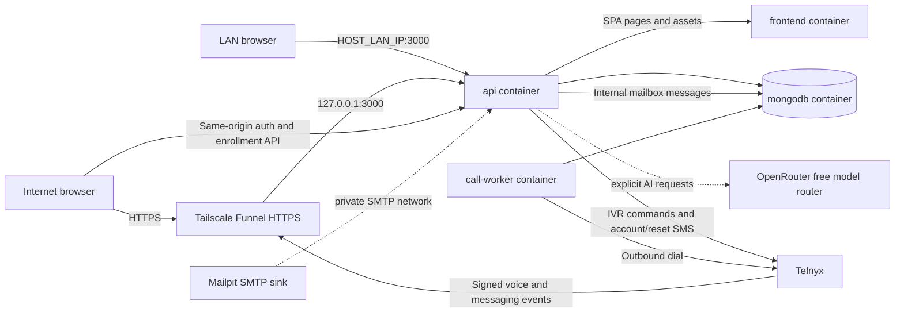

<!-- Purpose: document ईMAIL's runtime topology, request flows, persistence, and security boundaries. -->

# ईMAIL infrastructure architecture

## Scope

This iteration implements ईMAIL's phone enrollment, web authentication, account recovery, internal email interface, profile pictures, and optional AI email tools. Mail is stored in MongoDB and delivered only between existing ईMAIL accounts. User addresses use the internal `@niti` suffix and are not publicly deliverable email addresses.

## Containers

- `api` handles input validation, browser authentication, account lookup/status, password setup/reset, session-protected mailbox/profile/AI endpoints, health endpoints, signed Telnyx webhooks, IVR call-control commands, account-created SMS, and reset-code SMS requests. It proxies browser pages and assets to `frontend` so Funnel keeps one public entry point.
- `frontend` builds the React/Vite application into static assets and serves them privately from an unprivileged Nginx container. Compose publishes no host port for this service; LAN browsers reach it through the API proxy.
- `call-worker` claims durable call jobs from MongoDB and starts exactly one Telnyx call per API request. A dispatch error is terminal; no automatic call retry is made.
- `mongodb` stores users, expiring browser sessions, call attempts, OTP reset records, provider call events, webhook receipts, internal email messages, and per-user mailbox state. Persistent Docker volume storage is configured and call records have no TTL.
- User profile pictures are compressed to small square WebP images in the browser, bounded by the API, and stored with the user record. They are returned only to that user's authenticated session.
- `smtp` is Mailpit, a local-only SMTP sink. It has no host port, public listener, or external mail relay. Internal mailbox delivery is performed by the API and stored in MongoDB; Mailpit is not the mailbox store.
- Tailscale Funnel forwards to the API's loopback-published port, while the API also binds the configured host LAN IPv4 address for local browsers. The API keeps Helmet's HTTPS-only headers on Funnel requests and omits HTTPS-upgrade, COOP, HSTS, and origin-agent-cluster headers on HTTP LAN requests. Internal call-management routes require a bearer token, browser sessions use HTTP-only cookies, and provider callbacks are authenticated by Telnyx Ed25519 signatures.

## Call flow

1. `POST /api/v1/calls` requires `Authorization: Bearer <CALLS_API_TOKEN>` and exactly ten digits. The API prefixes `+91`, reserves that phone number against concurrent active calls, inserts a durable call record, and returns `202`.
2. The worker claims the queued record once, persists its dispatch state, and requests a Telnyx outbound call using `TELNYX_VOICE_APP_ID` and `TELNYX_CALLER_ID`. It supplies a base64 ईMAIL call ID as Telnyx `client_state` for webhook correlation.
3. On answer, the API asks Telnyx to gather one DTMF key from the language menu. Key 1 selects English and key 2 selects Hindi. It then presents the main menu: 1 create account, 2 forgot password, 9 repeat.
4. Pressing 1 performs a unique-phone account insert. An existing account gets a spoken notice; a new account stores the canonical number and internal `number@niti` address, then receives an SMS confirmation with the canonical phone number as the username. The internal `@niti` address is not sent to the user.
5. The browser can request a one-time code using `POST /api/v1/auth/password-reset/request` to set the initial password or recover an existing one. `POST /api/v1/passwords/reset` accepts the phone, OTP, and new password; OTPs are hashed, expire, are single-use, and are attempt-limited.
6. Pressing 9 repeats the main menu. Invalid DTMF repeats the current menu; a timeout is recorded and ends the call. The call ends without an automated redial.
7. Telnyx webhook event IDs are stored uniquely. Duplicate deliveries do not repeat account creation or OTP generation. Full voice event payloads and call metadata are retained indefinitely; messaging callbacks retain delivery metadata but not SMS text/OTP bodies. No media recording is requested.
8. `POST /api/v1/auth/login` verifies the phone/password pair and returns a same-origin HTTP-only cookie backed by an opaque, hashed MongoDB session. `GET /api/v1/auth/session` restores the UI after reload, and `POST /api/v1/auth/logout` revokes the session.
9. The signed-in mail UI uses `/api/v1/mail` routes. The API checks the browser session, resolves every recipient to an existing ईMAIL account with an `@niti` address, then creates sender Sent and recipient Inbox copies backed by a shared MongoDB message. No external address or public SMTP delivery is accepted.

10. Profile image uploads use session-protected `/api/v1/profile/picture` routes. The browser crops and compresses the selected image; the API accepts JPEG, PNG, or WebP up to 350 KiB and stores it with the account.
11. Session-protected `/api/v1/ai` routes send only text the user explicitly submits to OpenRouter. `OPENROUTER_MODEL` defaults to `openrouter/free`; prompts and model responses are not written to application logs or saved by the API. OpenRouter selects a hosted model, so submitted text leaves the local machine and is subject to OpenRouter and the selected model provider's policies. Generated messages stay editable until the user reviews and sends them.

## API surface

| Method | Route | Access | Purpose |
| --- | --- | --- | --- |
| `GET` | `/healthz` | Public | Liveness response. |
| `GET` | `/readyz` | Public | Readiness response including MongoDB availability. |
| `POST` | `/api/v1/calls` | ईMAIL bearer token | Validate a ten-digit number and enqueue a single outbound call. |
| `GET` | `/api/v1/calls/:callId` | ईMAIL bearer token | Return persisted call status and menu outcome. |
| `POST` | `/api/v1/onboarding/calls` | Public, rate-limited | Start an enrollment call without exposing the internal bearer token. |
| `GET` | `/api/v1/onboarding/calls/:callId` | Call ID | Return limited status for a browser-started enrollment call. |
| `POST` | `/api/v1/auth/login` | Public, rate-limited | Verify credentials and set an HTTP-only session cookie. |
| `GET` | `/api/v1/auth/session` | Session cookie | Return the signed-in user's username and phone. |
| `POST` | `/api/v1/auth/logout` | Session cookie | Revoke the current browser session. |
| `POST` | `/api/v1/auth/password-reset/request` | Public, rate-limited | Send an OTP to set or reset a password. |
| `POST` | `/api/v1/passwords/reset` | OTP proof | Verify SMS OTP and set/reset the account password. |
| `GET` | `/api/v1/mail/messages` | Session cookie | List the caller's internal mailbox folder. |
| `GET` | `/api/v1/mail/messages/:itemId` | Session cookie | Read a message copy owned by the caller. |
| `POST` | `/api/v1/mail/messages` | Session cookie | Send mail to existing ईMAIL `@niti` users. |
| `POST` / `PUT` | `/api/v1/mail/drafts` | Session cookie | Save or update a private draft. |
| `POST` | `/api/v1/mail/drafts/:itemId/send` | Session cookie | Send a saved draft internally. |
| `PATCH` / `DELETE` | `/api/v1/mail/messages/:itemId` | Session cookie | Update mailbox flags/folder or permanently delete from Trash. |
| `PUT` / `DELETE` | `/api/v1/profile/picture` | Session cookie | Save or remove the signed-in user's profile picture. |
| `GET` | `/api/v1/ai/status` | Session cookie | Report whether an OpenRouter key is configured. |
| `POST` | `/api/v1/ai/write` | Session cookie | Create an editable email subject and body from a short prompt. |
| `POST` | `/api/v1/ai/translate` | Session cookie | Translate text submitted by the signed-in user. |
| `POST` | `/api/v1/ai/replies` | Session cookie | Suggest three reply drafts for a message the user opened. |
| `POST` | `/webhooks/telnyx/voice` | Telnyx signature | Process call control events and DTMF. |
| `POST` | `/webhooks/telnyx/messaging` | Telnyx signature | Record message delivery events. |

## Data and failure behavior

- User phone numbers have a unique MongoDB index. Account-created SMS sends are marked pending until Telnyx accepts the message so a failed webhook attempt can retry them. Call records have a unique sparse active-number key; clearing it releases the number after a terminal call state.
- Browser sessions store only SHA-256 token hashes, expire after `SESSION_TTL_DAYS`, and are revoked on logout. The frontend shares the API origin, so the internal `CALLS_API_TOKEN` remains server-side.
- Each mailbox copy is scoped to its owner. External addresses are rejected, recipient accounts must already exist, and each user's Inbox/Sent/Drafts/Archive/Trash state is stored separately from the shared message body.
- Profile images are private account fields and are limited to supported image MIME types and 350 KiB. AI endpoints require a valid browser session, share an eight-request-per-minute limit, and do not persist submitted text in ईMAIL.
- Call records, full voice events, and webhook receipts persist in the `mongodb_data` volume. There is no expiry index. Messaging event history excludes SMS text so reset codes are not copied from provider callbacks into long-term logs.
- A worker crash or ambiguous provider timeout during dispatch is marked `dispatch_unknown` and is not retried. Its phone reservation remains until a late Telnyx event or manual resolution, avoiding a duplicate outbound call.
- Provider webhooks can be delivered more than once. Unique provider event IDs and persisted processing state make handlers idempotent.
- The Funnel hostname forwards to `127.0.0.1:3000`; LAN devices can use `HOST_LAN_IP:3000`. No container publishes MongoDB or SMTP ports to the host.

## Secrets and configuration

- `CALLS_API_TOKEN` authenticates internal/client requests to the call API. It is independent of Telnyx credentials.
- `TELNYX_API_KEY` authorizes API calls to Telnyx. `TELNYX_WEBHOOK_PUBLIC_KEY` verifies callback signatures and is not a secret.
- `MONGODB_URI` includes the Compose-only database credential. The MongoDB root password is local development configuration.
- `OPENROUTER_API_KEY` authorizes server-side optional AI requests and must stay in `.env`. `OPENROUTER_MODEL` defaults to the free-model router; hosted providers receive only text users explicitly submit to an AI feature.
- `.env` is ignored by Git. `.env.example` lists names and safe placeholders only.
- `OPENROUTER_API_KEY` is optional and server-only. `OPENROUTER_MODEL` defaults to OpenRouter's free-model router. Free model availability and limits are controlled by OpenRouter and its model providers; users should avoid submitting sensitive message content to external AI.
- Rotate any provider key disclosed outside the local secret file before using the integration.
